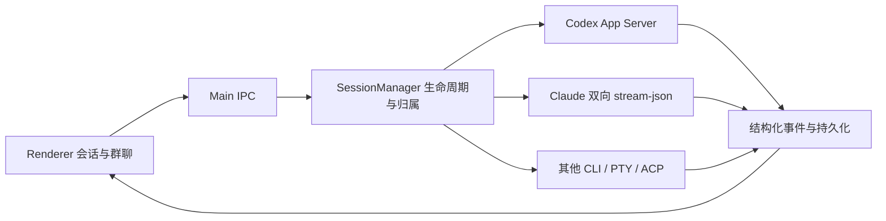

# 给公司 Agent 的架构与复用地图

结论：适合借鉴的是「一个会话一个原生 writer、Main 维护真实状态、界面只展示证据」这条链路。桌面 Hub 不是一个可直接多租户部署的后端。

| 要借鉴什么 | 起点 | 必须一起理解的边界 |
|---|---|---|
| 启动与数据隔离 | main-bootstrap.js、core/data-dir.js | Chromium profile 与 Hub 数据同时分开 |
| 会话生命周期 | core/session-manager.js | 归属、epoch、恢复、退出必须保持同一原生身份 |
| 原生协议 | main/codex-app-server-client.js、main/claude-stream-client.js | Codex App Server 与 Claude stream-json 独立驱动 |
| 消息提交 | main/ipc/prompt-submit-handlers.js | 未确认提交不能当成成功，也不能盲目重发 |
| 群聊编排 | core/group-chat-orchestrator.js、main/groupchat/dispatcher.js | 发言顺序、停止、错误传播和成员身份 |
| 开发协作 | core/dev-file-workflow.js、renderer/ran.js | 文件交付、作者/合并角色和项目自身规则 |
| 工作区 | core/workspace-service.js | 不把组织根当任务目录、不扫描整盘 |
| 账号中心 | core/account-center.js、core/account-adapters.js | 检测、打开授权、确认授权是不同状态 |
| 记忆 | core/hub-memory-service.js、renderer/memory-panel.js | 磁盘存在、已发送、正文已读取不能混称 |
| 当前公开版控制 | core/distribution.js、community-edition.json | 发行标记不接受用户配置启用私人模块 |
| 安装诊断 | core/community-setup.js、scripts/doctor.js | 已安装不等于已登录，错误不吞掉 |

## 推荐移植顺序

1. 先跑 `npm test` 和 GUI 夹具测试，理解 event/IPC/持久化路径。
2. 为你们的 agent 写 provider adapter，保留 submission/turn/session 的身份关联；不要把长 prompt 简单拼一个回车送 TUI。
3. 用模拟 provider 覆盖完成、失败、断连、停止和重启；再用你们自己的测试账号做真实网络验收。
4. UI 可以替换，状态不能改成依据终端文字猜测。未经原生确认的状态显示未知。

代价和边界：这套源码保留了成熟桌面 Hub 的大量模块，体积比一个空白脚手架大。部分历史兼容代码仍存在，但公开版不注册私人入口；新需求应沿明确的服务边界窄改。若变成公司多用户平台，需要另行设计身份认证、租户数据隔离、远程执行环境、密钥管理与审计，不能直接把本机 hook 端口开放出去。

## 已查看的公开参考

- [此前公开的 ai-group-chat-hub](https://github.com/TianLin0509/ai-group-chat-hub)：已有安装与 agent 手册，但最后推送为 2026-08-05，需要对齐新原生后端。
- [当前上游 claude-session-hub](https://github.com/TianLin0509/claude-session-hub)：本版基于 1.6.194 的提交快照，具体 SHA 见 community-edition.json。
- [AionUi](https://github.com/iOfficeAI/AionUi)：可借鉴安装引导、内置 agent 与外部 CLI 接入的分层。本次没有复制其源代码，也没有把它的能力算成本版已经实现。

上述仓库与官方 CLI 文档于 2026-09-19 查看，能力可能继续演进。
